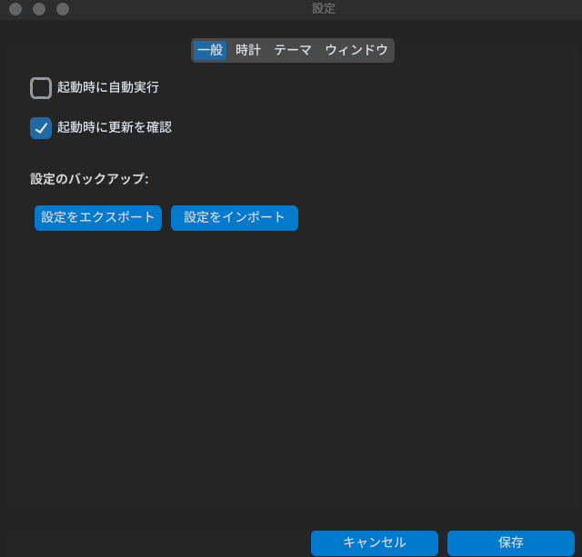
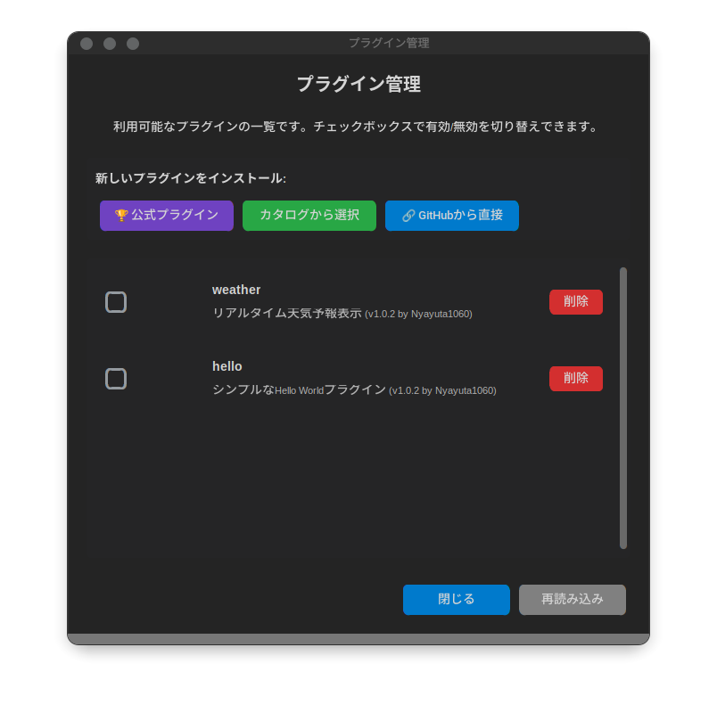
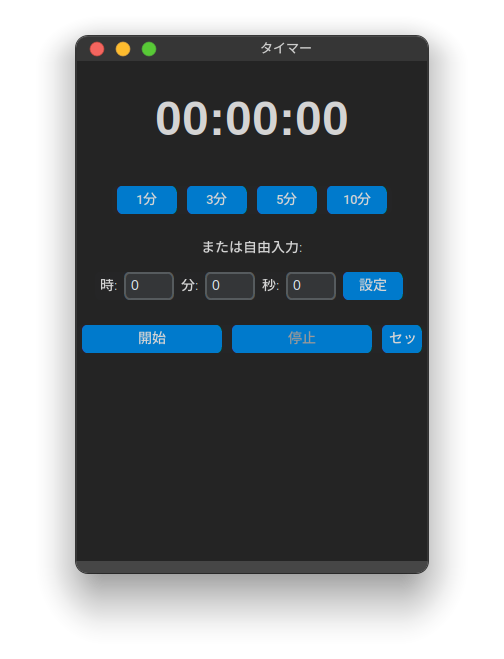
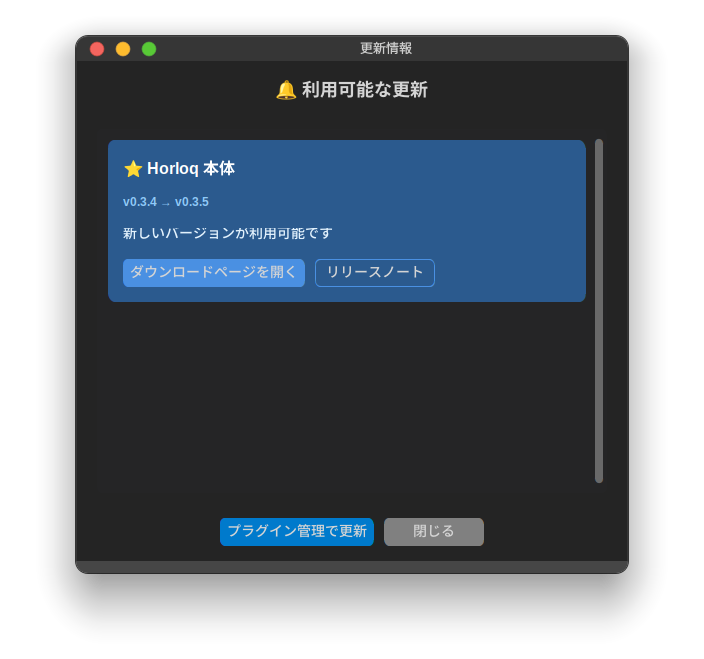

# Horloq - 拡張可能デスクトップ時計

> Horloq(オルロック)は、Python + CustomTkinterで作られたプラグインシステムを備えた高機能デスクトップ時計アプリケーションです。


[](https://www.python.org/downloads/)
[](LICENSE)
[](https://github.com/Nyayuta1060/Horloq/actions)
[]()

## 作品概要

Horloqは、デスクトップ上に常駐する高機能時計アプリケーションです。単なる時計表示にとどまらず、プラグインシステムによる自由な機能拡張を実現した、開発者フレンドリーなデスクトップツールです。

このアプリケーションの最大の特徴は、柔軟なプラグインシステムです。ユーザーは必要な機能だけを選択してインストールでき、独自のプラグインを開発して配布することも可能です。プラグインは `plugin.yaml` による宣言的なメタデータ管理を採用しており、Pythonコード内でのハードコーディングを排除した保守性の高い設計となっています。

技術的には、CustomTkinterを採用することでモダンなUI/UXを実現し、PyInstallerによるクロスプラットフォームビルドにより、Windows、macOS、Linuxの3つのプラットフォームで動作する実行ファイルを自動生成します。GitHub Actionsによる完全自動化されたCI/CDパイプラインを構築しており、タグをプッシュするだけで全プラットフォーム向けのバイナリが自動ビルドされ、ドラフトリリースとして公開されます。

プラグイン管理システムは、GitHub Releases APIを活用した自動更新検知機能を搭載しています。本体とプラグインの両方について、起動時に最新バージョンをチェックし、更新がある場合はユーザーに通知します。この仕組みにより、ユーザーは常に最新の機能とセキュリティ修正を利用できます。

バージョン管理には「Single Source of Truth」パターンを採用し、`horloq/__init__.py`の`__version__`変数を唯一の真実の情報源として、setup.pyやpyproject.tomlから動的に読み込む設計としました。これにより、バージョン番号の不整合を根本的に防止しています。

開発面では、包括的なドキュメント体系を整備し、ユーザー向け、プラグイン開発者向け、コントリビューター向けにそれぞれ適切なドキュメントを用意しています。特にWindows環境での依存ライブラリインストール問題に対しては、詳細なトラブルシューティングガイドを提供し、プラットフォーム固有の課題にも対応しています。

## スクリーンショット

<!-- TODO: 実際のスクリーンショットに置き換えてください -->

### メイン画面

*デスクトップに常駐する時計表示。ドラッグで自由に配置可能*

### 設定画面

*時計のフォーマット、テーマ、透明度などを細かくカスタマイズ*

### プラグイン管理

*公式プラグインをワンクリックでインストール・管理*

### タイマープラグイン

*プラグインとして提供されるカウントダウンタイマー*

### 更新通知

*本体とプラグインの更新を自動検知して通知*

## 主な特徴

- **デジタル/アナログ時計** - 切り替え可能な表示モード
- **カスタマイズ** - テーマ、色、フォント、透明度を自由に設定
- **プラグインシステム** - 機能を自由に追加・拡張
- **クロスプラットフォーム** - Windows, macOS, Linux対応
- **軽量** - メモリ使用量100MB以下
- **自動更新通知** - 本体とプラグインの更新を自動検知

## インストール

### バイナリダウンロード（推奨）

最新版: [Releases](https://github.com/Nyayuta1060/Horloq/releases/latest)

<details>
<summary><b>Linux</b></summary>

```bash
wget https://github.com/Nyayuta1060/Horloq/releases/latest/download/horloq-linux-x86_64
chmod +x horloq-linux-x86_64
./horloq-linux-x86_64
```
</details>

<details>
<summary><b>Windows</b></summary>

1. [horloq-windows-x86_64.exe](https://github.com/Nyayuta1060/Horloq/releases/latest/download/horloq-windows-x86_64.exe) をダウンロード
2. ダブルクリックして実行

> **注意**: Windows Defenderの警告が出る場合は「詳細情報」→「実行」をクリック
</details>

<details>
<summary><b>macOS</b></summary>

```bash
curl -L -o horloq https://github.com/Nyayuta1060/Horloq/releases/latest/download/horloq-macos-x86_64
chmod +x horloq
./horloq
```
</details>

### ソースからビルド

```bash
git clone https://github.com/Nyayuta1060/Horloq.git
cd Horloq
python -m venv venv
source venv/bin/activate  # Windows: venv\Scripts\activate
pip install -r requirements.txt
python -m horloq
```

## クイックスタート

1. **起動** - アプリケーションを起動するとデスクトップに時計が表示されます
2. **右クリックメニュー** - 設定、プラグイン管理にアクセス
3. **ドラッグで移動** - 好きな位置に配置
4. **プラグイン** - 右クリックメニューから追加機能をインストール

## プラグイン

### 公式プラグイン

各プラグインの詳細:[公式プラグイン集](https://github.com/Nyayuta1060/Horloq-Plugins)

### インストール方法

#### GUI（推奨）
1. Horloqを起動
2. 右クリック → 「プラグイン管理」
3. インストールしたいプラグインを選択

#### CLI
```bash
python -m horloq plugin install Nyayuta1060/Horloq-Plugins:timer
python -m horloq plugin list
```

### プラグイン開発

プラグインは `plugin.yaml` + Python コードで作成できます。

```yaml
# plugin.yaml
name: my_plugin
version: 1.0.0
author: Your Name
description: My awesome plugin
min_horloq_version: 0.1.0
```

詳細は [プラグイン開発ガイド](docs/PLUGIN_DEVELOPMENT.md) を参照してください。


##  開発

### 環境構築

```bash
# リポジトリをクローン
git clone https://github.com/Nyayuta1060/Horloq.git
cd Horloq

# 仮想環境を作成・有効化
python -m venv venv
source venv/bin/activate  # Linux/Mac
venv\Scripts\activate     # Windows

# 開発用依存関係をインストール
pip install -r requirements.txt
pip install -r requirements-dev.txt

# 開発モードで実行
python -m horloq
```

### ビルド

```bash
# ビルドスクリプトを使用（推奨）
chmod +x scripts/build.sh
./scripts/build.sh           # Linux/macOS
# または
scripts\build.bat            # Windows

# 手動ビルド
pyinstaller build.spec

# ビルド結果
ls dist/
```

## ドキュメント

- **[ドキュメントインデックス](docs/README.md)** - 全ドキュメントの案内
- [プラグイン開発ガイド](docs/PLUGIN_DEVELOPMENT.md) - プラグイン作成の詳細
- [開発ガイド](docs/DEVELOPMENT.md) - 開発環境のセットアップ
- [アーキテクチャ](docs/ARCHITECTURE.md) - システム設計
- [バージョン管理 & リリース](docs/VERSION_MANAGEMENT.md) - リリース手順
- [Windowsトラブルシューティング](docs/WINDOWS_TROUBLESHOOTING.md) - Windows環境の問題解決

## コントリビューション

コントリビューションを歓迎します！

1. リポジトリをフォーク
2. フィーチャーブランチを作成: `git checkout -b feature/amazing-feature`
3. コミット: `git commit -m 'feat: add amazing feature'`
4. プッシュ: `git push origin feature/amazing-feature`
5. プルリクエストを作成

詳細: [CONTRIBUTING.md](CONTRIBUTING.md)

## トラブルシューティング

### Windows でプラグインがインストールできない

- 権限エラー → `python -m pip install --user パッケージ名`
- pynput ビルドエラー → [Microsoft C++ Build Tools](https://visualstudio.microsoft.com/downloads/#build-tools-for-visual-studio-2022) が必要

詳細: [Windowsトラブルシューティング](docs/WINDOWS_TROUBLESHOOTING.md)

### その他の問題

[Issues](https://github.com/Nyayuta1060/Horloq/issues) で質問・報告してください。

## ライセンス

MIT ライセンス - 詳細は [LICENSE](LICENSE) を参照

## 謝辞

- [CustomTkinter](https://github.com/TomSchimansky/CustomTkinter) - モダンなUI
- [PyInstaller](https://pyinstaller.org/) - パッケージング
- すべてのコントリビューターの皆様

---

Made with ❤️ by [Nyayuta1060](https://github.com/Nyayuta1060)